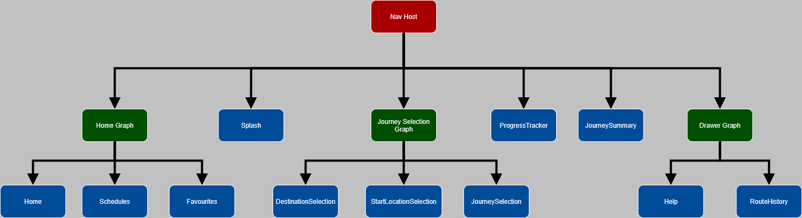
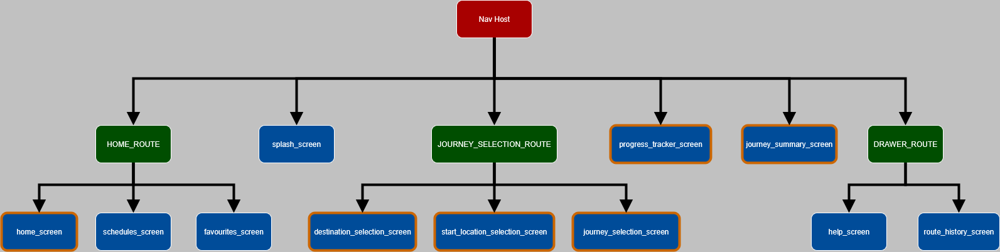

# 🚀 Android Project Documentation (Temporary README)

Hi guys  
This file is just a **temporary README** to help us all stay on the same page while we build the
app. Once we’re closer to finishing, we’ll replace this with a polished version.  
This guide explains the basics of how the app works so far.

---

## 📌 Entry Point: `MainActivity.kt`

Every Android app needs a **starting point**. For us, that’s the file:
[app\src\main\java\com\example\citiway\MainActivity.kt](https://github.com/Eduvos-ITDMA/CitiWay-App/blob/main/app/src/main/java/com/example/citiway/MainActivity.kt)

This file:

- Sets up the **user interface**.
- Loads the **navigation system** (explained below).
- Applies the **Material Theme** (so our app looks modern and consistent with Android design
  guidelines).

---

## 🧭 Navigation Graph

Instead of manually switching between screens, Android lets us use a **Navigation Graph**.

- Think of it as a **map** of all the screens in our app.
- It defines **where you can go** and **how to get there**.
- Each box in the diagram below represents a screen or group of screens.

We’re using **Jetpack Navigation Component**, which makes it easier to manage complex navigation.

---

## 📂 Navigation Graph Breakdown

- **Nav Host**  
  This is the "container" that holds our screens.  
  All navigation happens inside it.

- **Home Graph**  
  Handles the main app features:
    - 🏠 Home screen
    - 📅 Schedules
    - ⭐ Favourites

- **Journey Selection Graph**  
  Handles journey planning:
    - 🎯 Destination selection
    - 📍 Start location selection
    - 🚗 Journey selection

- **Drawer Graph**  
  Handles extra stuff you can open from a side drawer menu:
    - ❓ Help
    - 📜 Route history

- **Other Screens**
    - 🌊 Splash (the first screen you see when the app loads)
    - 📊 Progress tracker
    - 📝 Journey summary

---

## 📱 Bottom Navigation Bar

Our app uses a **bottom navigation bar** (like most modern apps).

- It lets users switch between **major sections** of the app quickly.
- It’s **linked to the navigation graph**, so when you tap a button, it tells the Nav Host which
  screen to show.
- Only some screens have a bottom navigation bar.

This nav graph diagram shows the names of the **screens** (destinations) and **routes** used in the
actual code. Only the screens with a border get a bottom nav bar.

---

## 🎨 Material Theme

We’re using **Material Design 3 (Material You)**, which is Google’s official design system for
Android.

This means:

- Buttons, colors, and fonts follow **modern Android standards** automatically.
- The theme adapts to the user’s system colors (on newer Android versions).
- We don’t have to design every little thing from scratch — Material takes care of a lot for us.

Refer to **Color.kt** and **Theme.kt** in *\citiway\ui\theme\*

---

## 📝 Summary

- Start point = `MainActivity.kt`
- Navigation = handled by **Navigation Graph**
- Bottom Nav Bar = for switching major sections
- Material Theme = modern look, less manual styling  
