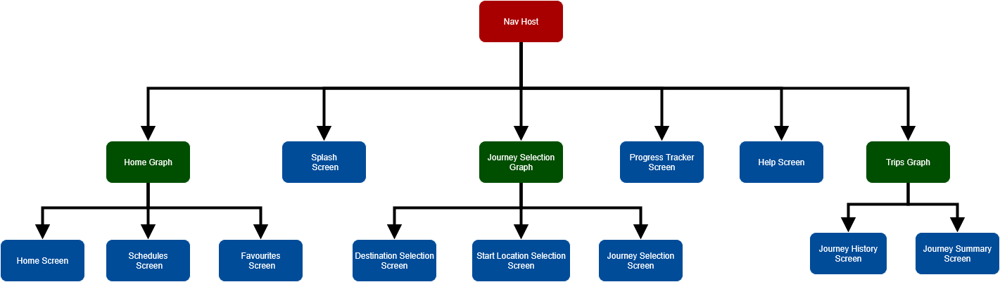
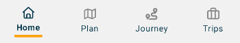
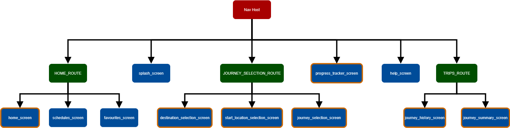
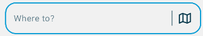

# 🚀 Android Project Documentation (Temporary README)

Hi guys  
This file is just a **temporary README** to help us all stay on the same page while we build the
app. Once we’re closer to finishing, we’ll replace this with a polished version.  
This guide explains the basics of how the app works so far.

---

## 📌 Entry Point: `MainActivity.kt`

Every Android app needs a **starting point**. For us, that’s the [MainActivity.kt](https://github.com/Eduvos-ITDMA/CitiWay-App/blob/main/app/src/main/java/com/example/citiway/MainActivity.kt) file:

This file currently:

- Sets up the **user interface**.
- Loads the **navigation system** (explained below).
- Applies the **Material Theme** (so our app looks modern and consistent with Android design
  guidelines).

---

## 🧭 Navigation Graph

Instead of manually switching between screens, Android lets us use a **Navigation Graph**.

- Think of it as a **map** of all the screens in our app.
- It defines **where you can go** and **how to get there**.
- Each box in the diagram below represents a screen or group of screens.

We’re using the **Jetpack Navigation Component**, which makes it easier to manage complex navigation.



---

## 📂 Navigation Graph Breakdown

- **Nav Host**  
  This is the "container" that holds our screens. All navigation happens inside it.

- **Home Graph**  
  Handles the main app features:
  - 🏠 Home screen
  - 📅 Schedules
  - ⭐ Favourites

- **Journey Selection Graph**  
  Handles journey planning:
  - 🎯 Destination selection
  - 📍 Start location selection
  - 🚗 Journey selection

- **Trips Graph**  
  Handles information related to the user's completed journeys (trips)
  - 📜 Journey History
  - 📝 Journey Summary

- **Other Screens**
  - 🌊 Splash (the first screen you see when the app loads)
  - 📊 Progress tracker
  - ❓ Journey summary

---

## 📱 Bottom Navigation Bar

Our app uses a **bottom navigation bar** (like most modern apps).

- It lets users switch between **major sections** of the app quickly.
- It’s **linked to the navigation graph**, so when you tap a button, it tells the Nav Host which
  screen to show.
- Only some screens have a bottom navigation bar.

The current bottom nav bar differs from the figma design due to a number of design considerations. Furthermore, we are using a Menu (hamburger icon) in the Top Bar to offer additional navigation and settings options.

#### Old Design


#### Current Design


The following nav graph diagram shows the names of the **screens** (destinations) and **routes** used in the
actual code. Only the screens with a border get a dedicated bottom nav bar item/tab.



---

## 🎨 Material Theme

We’re using **Material Design 3 (Material You)**, which is Google’s official design system for
Android.

This means:

- **Color.kt** defines the colours we're using throughout the app.
- **Theme.kt** packages these colours into a _darkColorScheme_ and _lightColorScheme_, allowing the app to automatically adapt when the user changes their system theme.
- **Type.kt** defines a number of typography styles we can use, such as _displayLarge_, _headlineMedium_, _titleMedium_, etc.

To see the full setup, review these files in the [ui\theme\\](https://github.com/Eduvos-ITDMA/CitiWay-App/blob/main/app/src/main/java/com/example/citiway/ui/theme) directory.

---

## 🧩 Some Custom Components

A number of UI components have been made that can be reused in different screens through the app. More such components will be coded as we go along. These are intended to be reused while allowing flexibility through the arguments you pass. These custom composables are located in the [components/](https://github.com/Eduvos-ITDMA/CitiWay-App/blob/main/app/src/main/java/com/example/citiway/ui/components) directory

I included code blocks above each one to document the purpose, intended usage of the component and each of its parameters in detail. This documentation will appear in Android Studio when you hover over the component in code, or you can view it directly in the file its located in. Please ask me (Caleb) how to use them if you are confused.

### Example: LocationSearchField
A text input field designed for location searching, featuring an inline action icon. This composable provides a styled text field, typically used for entering location queries, and includes a placeholder for text and an icon slot for actions.

Refer to the figma design to see how this component will be reused.

#### Appearance on home screen:


---

## 📝 Summary

- Start point = `MainActivity.kt`
- Navigation = handled by **Navigation Graph**
- Bottom Nav Bar = for switching major sections
- Material Theme = modern look, less manual styling
- Custom components = reduce development time and effort through reusability

## 🗄️ Database Setup (Room + Repository Pattern)

**Date: October 13, 2025**

### Overview
Implemented complete Room database architecture based on ERD design with repository pattern for clean data access.

### Database Schema
- **8 Entity Tables**: User, Provider, Route, Trip, TripRoute, MonthlySpend, MyCitiFare, MetrorailFare
- **Foreign Key Relationships**: Proper referential integrity with cascade deletes
- **Nullable Fields**: All fields nullable for flexible development and testing

### Architecture

data/
├── local/
│   ├── entities/        # Database table definitions
│   ├── dao/            # Data Access Objects (SQL queries)
│   ├── CitiWayDatabase.kt
│   └── DatabaseSeeder.kt
└── repository/
└── CitiWayRepository.kt    # Single source of truth

### Repository Pattern Benefits
- ✅ **Separation of Concerns**: ViewModels don't directly access DAOs
- ✅ **Centralized Logic**: All data operations in one place
- ✅ **Easier Testing**: Mock repository instead of multiple DAOs
- ✅ **Future-Proof**: Easy to add API calls alongside database operations
- ✅ **Consistency**: Uniform data access patterns across the app

### Key Features
- Flow-based reactive queries for real-time UI updates
- DatabaseSeeder with realistic South African transport data (MyCiti, Metrorail, Golden Arrow)
- Coroutine-based async operations
- Proper dependency injection via ViewModelFactory

### Usage Example
```kotlin
// In the Composable/Screens
val database = CitiWayDatabase.getDatabase(context)
val repository = CitiWayRepository(database)

val viewModel: MyViewModel = viewModel(
    factory = viewModelFactory { 
        MyViewModel(repository) 
    }
)

Test Data
Run DatabaseSeeder.seedDatabase() to populate with sample data:

Sample users, providers, routes
Realistic fare structures
Test trips and monthly spend data